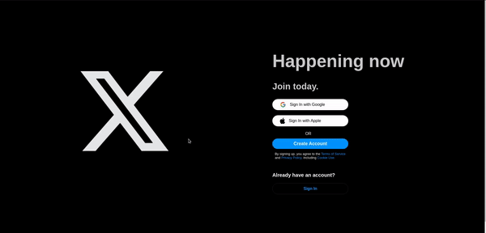

# Twitter Clone
🚀 I have created a LinkedIn Clone using React.js, Firebase, Styled Components, and Redux.

## Features

1️⃣ Users can easily log in and log out.
2️⃣ Users have the ability to create posts.
3️⃣ The website allows uploading images and videos.
4️⃣ Users can see posts from other users.
5️⃣ The website is fully responsive, adjusting seamlessly to different screen sizes.

## Website Look
